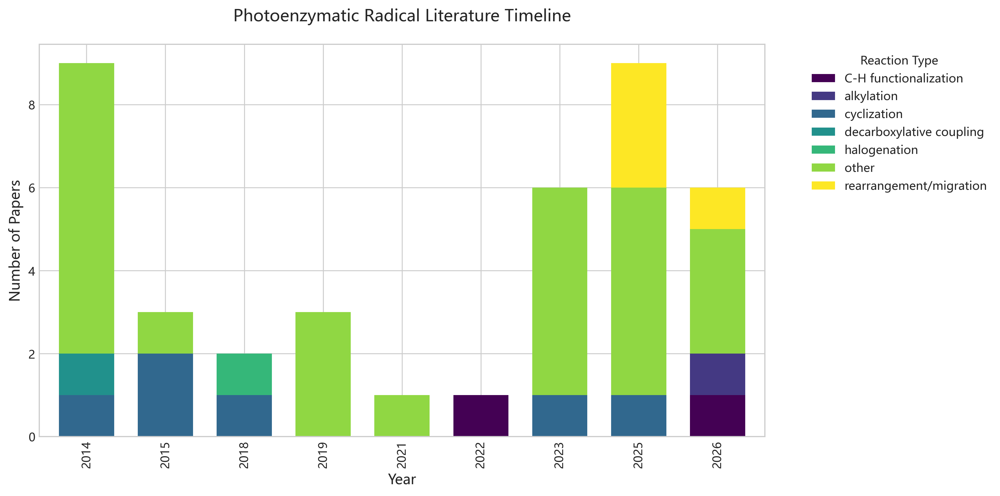
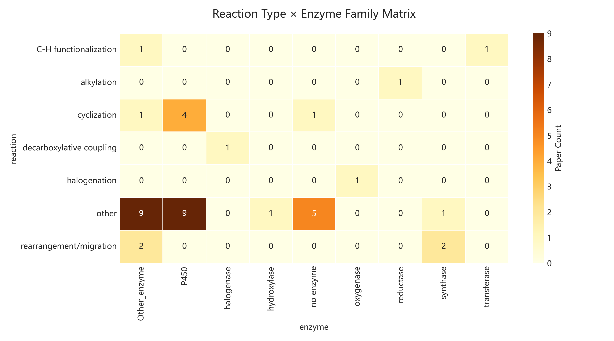
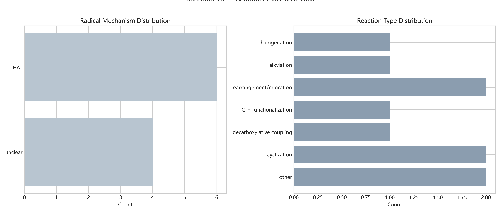

# 光酶自由基催化知识脉络图谱

> 生成时间: 2026-06-05 13:52
> 文献总量: 40 篇

## 一、领域概览

### 1.1 酶家族覆盖度

- **P450**: 13 篇
- **Other_enzyme**: 13 篇
- **no enzyme**: 6 篇
- **synthase**: 3 篇
- **halogenase**: 1 篇
- **transferase**: 1 篇
- **reductase**: 1 篇
- **oxygenase**: 1 篇
- **hydroxylase**: 1 篇

### 1.2 反应类型分布

- **other**: 25 篇
- **cyclization**: 6 篇
- **rearrangement/migration**: 4 篇
- **C-H functionalization**: 2 篇
- **decarboxylative coupling**: 1 篇
- **alkylation**: 1 篇
- **halogenation**: 1 篇

### 1.3 自由基机制分类

- **HAT**: 28 篇
- **unclear**: 12 篇

## 二、时间演化趋势

## 三、反应-酶映射矩阵

## 四、机制流向概览

## 五、核心创新点提炼

### Biocatalytic Radical C(sp3)–N Coupling via Active Site Te... (2026)
- **DOI**: 10.21203/rs.3.rs-9204910/v1
- **创新**: 基于标题推断: Biocatalytic Radical C(sp3)–N Coupling via Active Site Templ...
- **局限**: 需LLM进一步提取

### Metalloenzyme-Catalyzed Radical Reactions Unknown or Unco... (2026)
- **DOI**: 10.1021/acs.chemrev.5c00837
- **创新**: 基于标题推断: Metalloenzyme-Catalyzed Radical Reactions Unknown or Uncommo...
- **局限**: 需LLM进一步提取

### Highly stereoselective synthesis of allylic β-lactams via... (2026)
- **DOI**: 10.1039/d6sc01440b
- **创新**: 基于标题推断: Highly stereoselective synthesis of allylic β-lactams via en...
- **局限**: 需LLM进一步提取

### Enantioselective Intramolecular Benzylic C–H Amination En... (2026)
- **DOI**: 10.1002/chem.71018
- **创新**: 基于标题推断: Enantioselective Intramolecular Benzylic C–H Amination Enabl...
- **局限**: 需LLM进一步提取

### Chiral S(VI) platform unifies selective C–H amination of ... (2026)
- **DOI**: 10.1126/science.aee3321
- **创新**: 基于标题推断: Chiral S(VI) platform unifies selective C–H amination of com...
- **局限**: 需LLM进一步提取

### Engineering non-haem enzymes for nickel-catalysed C(sp2)‒... (2026)
- **DOI**: 10.1038/s44160-026-01003-w
- **创新**: 基于标题推断: Engineering non-haem enzymes for nickel-catalysed C(sp2)‒S c...
- **局限**: 需LLM进一步提取

### Structure–Function Analysis of the Self-Sufficient CYP102... (2025)
- **DOI**: 10.3390/ijms26052161
- **创新**: 基于标题推断: Structure–Function Analysis of the Self-Sufficient CYP102 Fa...
- **局限**: 需LLM进一步提取

### Nonheme Fe Enzyme‐Catalyzed Enantiodivergent Nitrogen Mig... (2025)
- **DOI**: 10.1002/anie.202524718
- **创新**: 基于标题推断: Nonheme Fe Enzyme‐Catalyzed Enantiodivergent Nitrogen Migrat...
- **局限**: 需LLM进一步提取

### Biocatalytic Synthesis of N-Protected α-Amino Acids throu... (2025)
- **DOI**: 10.1021/jacs.5c11008
- **创新**: 基于标题推断: Biocatalytic Synthesis of N-Protected α-Amino Acids through ...
- **局限**: 需LLM进一步提取

### Expanding the Terpene Universe: Synthetic Biology and Non... (2025)
- **DOI**: 10.3390/molecules30204065
- **创新**: 基于标题推断: Expanding the Terpene Universe: Synthetic Biology and Non-Na...
- **局限**: 需LLM进一步提取

### Metabolic Engineering of the 5‐Aminolevulinate Biosynthet... (2025)
- **DOI**: 10.1002/anie.202512156
- **创新**: 基于标题推断: Metabolic Engineering of the 5‐Aminolevulinate Biosynthetic ...
- **局限**: 需LLM进一步提取

### The role and mechanisms of canonical and non-canonical ta... (2025)
- **DOI**: 10.1039/d4np00048j
- **创新**: 基于标题推断: The role and mechanisms of canonical and non-canonical tailo...
- **局限**: 需LLM进一步提取

### Ascorbate-enabled C-H bond amination catalyzed by myoglob... (2025)
- **DOI**: 10.1016/j.jinorgbio.2025.113207
- **创新**: 基于标题推断: Ascorbate-enabled C-H bond amination catalyzed by myoglobin ...
- **局限**: 需LLM进一步提取

### Enzyme-catalyzed C(sp3)–H aminations for the highly enant... (2025)
- **DOI**: 10.1039/d5ra01905b
- **创新**: 基于标题推断: Enzyme-catalyzed C(sp3)–H aminations for the highly enantios...
- **局限**: 需LLM进一步提取

### Engineering metalloenzymes for new-to-nature carbene and ... (2025)
- **DOI**: 10.1016/s1872-2067(25)64659-6
- **创新**: 基于标题推断: Engineering metalloenzymes for new-to-nature carbene and nit...
- **局限**: 需LLM进一步提取

### Regio- and Enantioselective Catalytic δ-C-H Amidation of ... (2023)
- **DOI**: 10.1021/jacs.3c05258
- **创新**: 基于标题推断: Regio- and Enantioselective Catalytic δ-C-H Amidation of Dio...
- **局限**: 需LLM进一步提取

### Chiral Iron Porphyrins Catalyze Enantioselective Intramol... (2023)
- **DOI**: 10.1002/anie.202218577
- **创新**: 基于标题推断: Chiral Iron Porphyrins Catalyze Enantioselective Intramolecu...
- **局限**: 需LLM进一步提取

### Aspartyl β-Turn-Based Dirhodium(II) Metallopeptides for B... (2023)
- **DOI**: 10.1021/jacs.3c03587
- **创新**: 基于标题推断: Aspartyl β-Turn-Based Dirhodium(II) Metallopeptides for Benz...
- **局限**: 需LLM进一步提取

### Mechanistic snapshots of rhodium-catalyzed acylnitrene tr... (2023)
- **DOI**: 10.1126/science.adh8753
- **创新**: 基于标题推断: Mechanistic snapshots of rhodium-catalyzed acylnitrene trans...
- **局限**: 需LLM进一步提取

### Catalytic Enantioselective Amination of Enol Silyl Ethers... (2023)
- **DOI**: 10.1021/acs.orglett.3c00940
- **创新**: 基于标题推断: Catalytic Enantioselective Amination of Enol Silyl Ethers Us...
- **局限**: 需LLM进一步提取

### Catalytic, asymmetric carbon-nitrogen bond formation usin... (2023)
- **DOI**: 10.1039/D3SC04661C
- **创新**: 基于标题推断: Catalytic, asymmetric carbon-nitrogen bond formation using m...
- **局限**: 需LLM进一步提取

### Enzymatic Nitrogen Insertion into Unactivated C–H Bonds (2022)
- **DOI**: 10.1021/jacs.2c08285
- **创新**: 基于标题推断: Enzymatic Nitrogen Insertion into Unactivated C–H Bonds...
- **局限**: 需LLM进一步提取

### Nitrene transfers mediated by natural and artificial iron... (2021)
- **DOI**: 10.1016/j.jinorgbio.2021.111613
- **创新**: 基于标题推断: Nitrene transfers mediated by natural and artificial iron en...
- **局限**: 需LLM进一步提取

### Nickel-Catalyzed Asymmetric Hydrogenation of N-Sulfonyl I... (2019)
- **DOI**: 10.1002/anie.201902576
- **创新**: 基于标题推断: Nickel-Catalyzed Asymmetric Hydrogenation of N-Sulfonyl Imin...
- **局限**: 需LLM进一步提取

### Repurposing Nonheme Iron Hydroxylases To Enable Catalytic... (2019)
- **DOI**: 10.1021/jacs.8b13906
- **创新**: 基于标题推断: Repurposing Nonheme Iron Hydroxylases To Enable Catalytic Ni...
- **局限**: 需LLM进一步提取

### Nitrene Transfer Catalyzed by a Non-Heme Iron Enzyme and ... (2019)
- **DOI**: 10.1021/jacs.9b11608
- **创新**: 基于标题推断: Nitrene Transfer Catalyzed by a Non-Heme Iron Enzyme and Enh...
- **局限**: 需LLM进一步提取

### 2-Oxoglutarate-Dependent Oxygenases. (2018)
- **DOI**: 10.1146/annurev-biochem-061516-044724
- **创新**: 基于标题推断: 2-Oxoglutarate-Dependent Oxygenases....
- **局限**: 需LLM进一步提取

### Unprecedented Cyclization Catalyzed by a Cytochrome P450 ... (2018)
- **DOI**: 10.1021/jacs.8b02769
- **创新**: 基于标题推断: Unprecedented Cyclization Catalyzed by a Cytochrome P450 in ...
- **局限**: 需LLM进一步提取

### Enantioselective Enzyme-Catalyzed Aziridination Enabled b... (2015)
- **DOI**: 10.1021/acscentsci.5b00056
- **创新**: 基于标题推断: Enantioselective Enzyme-Catalyzed Aziridination Enabled by A...
- **局限**: 需LLM进一步提取

### Expanding the Enzyme Universe: Accessing Non-Natural Reac... (2015)
- **DOI**: 10.1002/anie.201409470
- **创新**: 基于标题推断: Expanding the Enzyme Universe: Accessing Non-Natural Reactio...
- **局限**: 需LLM进一步提取

### Enzymatic C(sp3)-H Amination: P450-Catalyzed Conversion o... (2015)
- **DOI**: 10.1021/cs5018612
- **创新**: 基于标题推断: Enzymatic C(sp3)-H Amination: P450-Catalyzed Conversion of C...
- **局限**: 需LLM进一步提取

### P450-Catalyzed Intramolecular sp3 C–H Amination with Aryl... (2014)
- **DOI**: 10.1021/cs400893n
- **创新**: 基于标题推断: P450-Catalyzed Intramolecular sp3 C–H Amination with Arylsul...
- **局限**: 需LLM进一步提取

### Direct nitration and azidation of aliphatic carbons by an... (2014)
- **DOI**: 10.1038/nchembio.1438
- **创新**: 基于标题推断: Direct nitration and azidation of aliphatic carbons by an ir...
- **局限**: 需LLM进一步提取

### Enantioselective Imidation of Sulfides via Enzyme-Catalyz... (2014)
- **DOI**: 10.1021/ja503593n
- **创新**: 基于标题推断: Enantioselective Imidation of Sulfides via Enzyme-Catalyzed ...
- **局限**: 需LLM进一步提取

### Intramolecular C(sp3)—H amination of arylsulfonyl azides ... (2014)
- **DOI**: 10.1016/j.bmc.2014.05.015
- **创新**: 基于标题推断: Intramolecular C(sp3)—H amination of arylsulfonyl azides wit...
- **局限**: 需LLM进一步提取

### Enhancing the Efficiency and Regioselectivity of P450 Oxi... (2014)
- **DOI**: 10.1002/cbic.201400060
- **创新**: 基于标题推断: Enhancing the Efficiency and Regioselectivity of P450 Oxidat...
- **局限**: 需LLM进一步提取

### Structural, Functional, and Spectroscopic Characterizatio... (2014)
- **DOI**: 10.1002/cbic.201402241
- **创新**: 基于标题推断: Structural, Functional, and Spectroscopic Characterization o...
- **局限**: 需LLM进一步提取

### Improved cyclopropanation activity of histidine-ligated c... (2014)
- **DOI**: 10.1002/anie.201402809
- **创新**: 基于标题推断: Improved cyclopropanation activity of histidine-ligated cyto...
- **局限**: 需LLM进一步提取

### Non‐natural Olefin Cyclopropanation Catalyzed by Diverse ... (2014)
- **DOI**: 10.1002/cbic.201402286
- **创新**: 基于标题推断: Non‐natural Olefin Cyclopropanation Catalyzed by Diverse Cyt...
- **局限**: 需LLM进一步提取

### Enzyme-Controlled Nitrogen-Atom Transfer Enables Regiodiv... (2014)
- **DOI**: 10.1021/ja509308v
- **创新**: 基于标题推断: Enzyme-Controlled Nitrogen-Atom Transfer Enables Regiodiverg...
- **局限**: 需LLM进一步提取

---
*Generated by Zotero Photoenzyme Knowledge Agent*