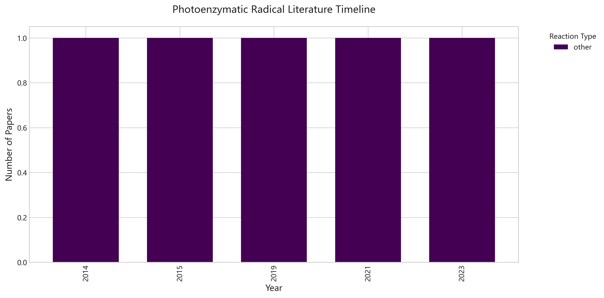
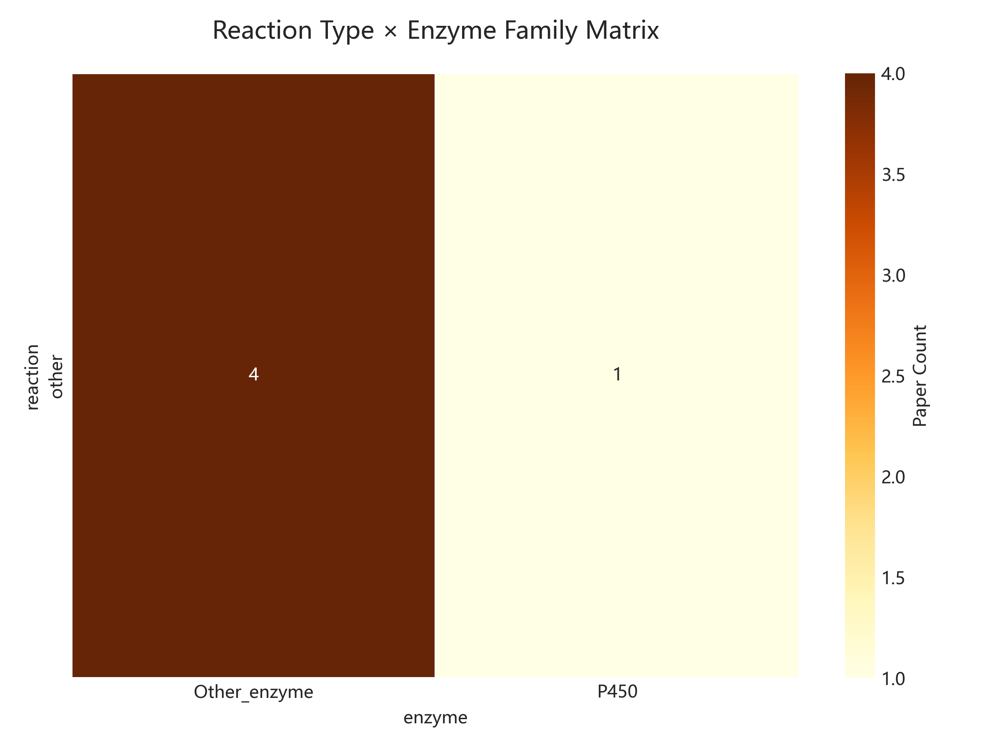
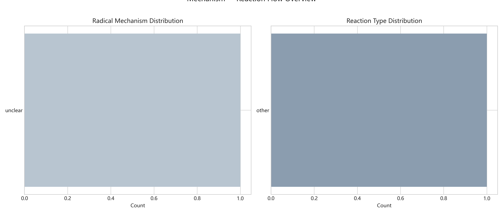

# 光酶自由基催化知识脉络图谱

> 生成时间: 2026-06-05 13:49
> 文献总量: 5 篇

## 一、领域概览

### 1.1 酶家族覆盖度

- **Other_enzyme**: 4 篇
- **P450**: 1 篇

### 1.2 反应类型分布

- **other**: 5 篇

### 1.3 自由基机制分类

- **unclear**: 5 篇

## 二、时间演化趋势

## 三、反应-酶映射矩阵

## 四、机制流向概览

## 五、核心创新点提炼

### Catalytic, asymmetric carbon-nitrogen bond formation usin... (2023)
- **DOI**: 10.1039/D3SC04661C
- **创新**: 基于标题推断: Catalytic, asymmetric carbon-nitrogen bond formation using m...
- **局限**: 需LLM进一步提取

### Nitrene transfers mediated by natural and artificial iron... (2021)
- **DOI**: 10.1016/j.jinorgbio.2021.111613
- **创新**: 基于标题推断: Nitrene transfers mediated by natural and artificial iron en...
- **局限**: 需LLM进一步提取

### Nitrene Transfer Catalyzed by a Non-Heme Iron Enzyme and ... (2019)
- **DOI**: 10.1021/jacs.9b11608
- **创新**: 基于标题推断: Nitrene Transfer Catalyzed by a Non-Heme Iron Enzyme and Enh...
- **局限**: 需LLM进一步提取

### Enantioselective Enzyme-Catalyzed Aziridination Enabled b... (2015)
- **DOI**: 10.1021/acscentsci.5b00056
- **创新**: 基于标题推断: Enantioselective Enzyme-Catalyzed Aziridination Enabled by A...
- **局限**: 需LLM进一步提取

### Enzyme-Controlled Nitrogen-Atom Transfer Enables Regiodiv... (2014)
- **DOI**: 10.1021/ja509308v
- **创新**: 基于标题推断: Enzyme-Controlled Nitrogen-Atom Transfer Enables Regiodiverg...
- **局限**: 需LLM进一步提取

---
*Generated by Zotero Photoenzyme Knowledge Agent*